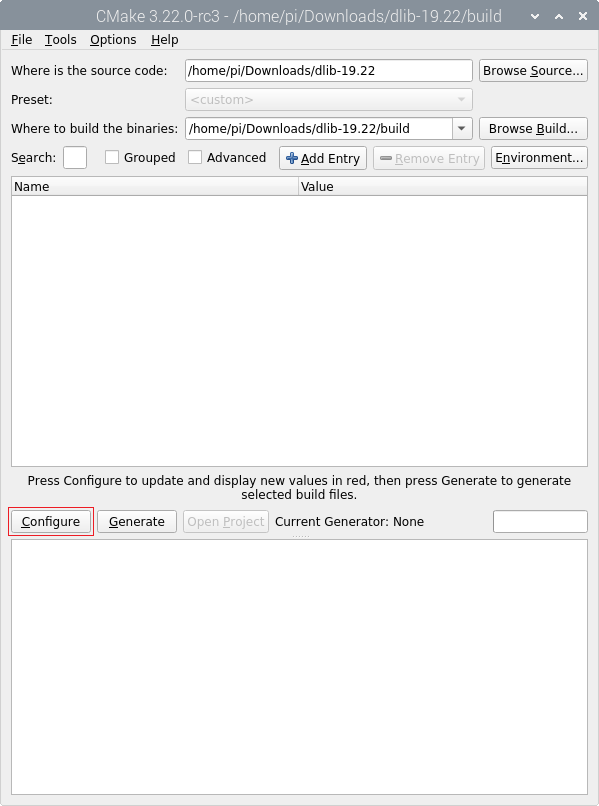

### Compilando e Configurando o Dlib para RaspiOS ARM64

Abra o Terminal e instale as seguintes dependências:

```bash
$ sudo apt-get install libx11-dev
$ sudo apt-get install libopenblas-dev liblapack-dev
```

> Não é necessário instalar o pacote `libgtk-3-dev`.

Elas são necessárias para que o Dlib funcione corretamente.

Acesse o site do [Dlib](http://dlib.net/) e baixe o código fonte `dlib-19.22.tar.bz2`.

Acesse o site do [CMake](https://cmake.org/download/) e baixe o Instalador `cmake-3.22.0-linux-aarch64.sh` ou o TAR `cmake-3.22.0-linux-aarch64.tar.gz` do Linux aarch64.

Então instale ou descompacte o CMake em algum diretório.

Descompacte o TAR `dlib-19.22.tar.bz2` em algum diretório, entre na pasta `dlib-19.22` e crie uma nova pasta chamada `build`.

> Pode ser em qualquer diretório, mais tarde essa pasta será deletada.

Abra o CMake-GUI, e clique no botão `Browse Source...`, então selecione o diretório `dlib-19.22`.

> Você pode encontrar o `CMake-GUI` dentro da pasta `bin` que está dentro do diretório do CMake.

Clique no botão `Browse Build...` e selecione o diretório: `dlib-19.22/build`.

Clique no botão `Configure`.



Então selecione o compilador `Unix Makefiles` e clique no botão `Finish`.


Clique no botão `Configure` para atualizar os valores.


Por fim, clique em `Genarate`, então feche o CMake-GUI.

Abra o Terminal e navege até o diretório `dlib-19.22/build` e execute o comando `make`:

```bash
make
```

> Pode ser informado o parâmetro `-j` seguido pela quantidade de processos em paralelo que você deseja executar, por exemplo: `-j2`, `-j3` ou `-j4`. Porém, passar esse parâmetro pode travar o seu Raspberry Pi.


Ao final do processo, o arquivo `dlib-19.22/build/dlib/libdlib.a` será gerado.


Copie o arquivo `dlib-19.22/build/dlib/libdlib.a` para dentro do diretório do projeto `DlibFaceDetectionHOG/dep/dlib/lib/`.

Copie a pasta `dlib-19.22/dlib` para dentro do diretório do projeto `DlibFaceDetectionHOG/dep/dlib/include/`.

Após isso, você pode excluir o diretório `dlib-19.22`.

Com isso, o projeto estará pronto para ser compilado.