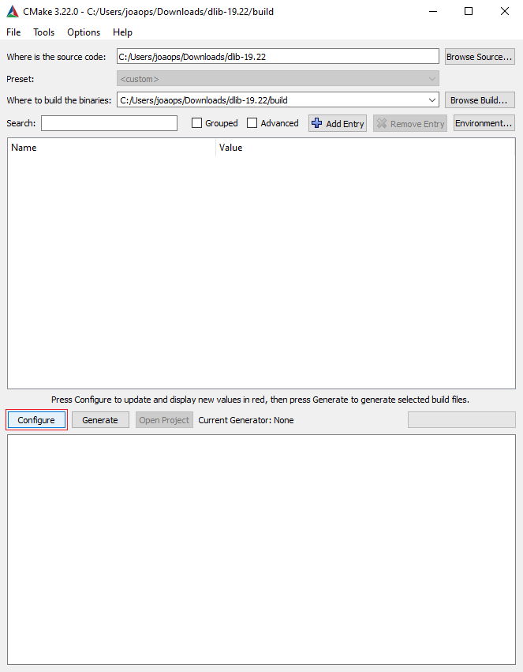
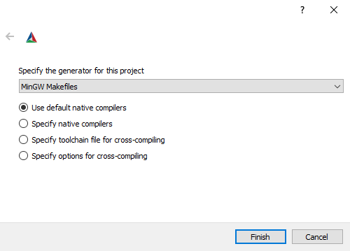
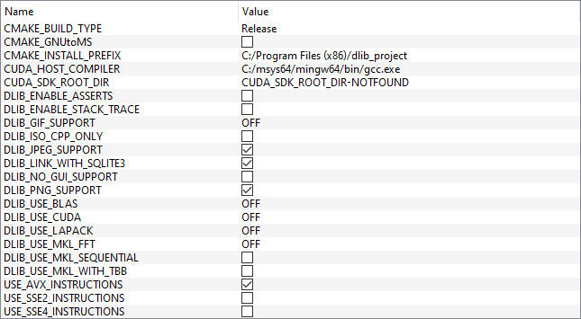
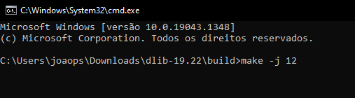
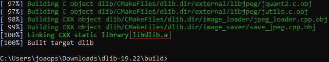

### Compilando e Configurando o Dlib para Windows x64

Acesse o site do [Dlib](http://dlib.net/) e baixe o código fonte `dlib-19.22.zip`.

Acesse o site do [CMake](https://cmake.org/download/) e baixe o Instalador `cmake-3.22.0-windows-x86_64.msi` ou o ZIP `cmake-3.22.0-windows-x86_64.zip`.

Então instale ou descompacte o CMake em algum diretório.

Descompacte o ZIP `dlib-19.22.zip` em algum diretório, entre na pasta `dlib-19.22` e crie uma nova pasta chamada `build`.

> Pode ser em qualquer diretório, mais tarde essa pasta será deletada.

Abra o CMake-GUI, e clique no botão `Browse Source...`, então selecione o diretório `dlib-19.22`.

> Você pode encontrar o `CMake-GUI` dentro da pasta `bin` que está dentro do diretório do CMake.

Clique no botão `Browse Build...` e selecione o diretório: `dlib-19.22/build`.

Clique no botão `Configure`.



Então selecione o compilador `MinGW Makefiles` e clique no botão `Finish`.



Marque a opção `USE_AVX_INSTRUCTIONS` e clique no botão `Configure` para atualizar os valores.



Por fim, clique em `Genarate`, então feche o CMake-GUI.

Abra o Prompt de Comandos e navege até o diretório `dlib-19.22/build` e execute o comando `make`:

```bash
make -j 12
```

> O parâmetro `-j 12` indica que serão executados 12 processos em paralelo, o processador que estou usando possui 6 núcleos e 12 threads, então eu posso executar até 12 processos. Verifique quantas threads o seu processador possui para usar o parâmetro correto.



Ao final do processo, o arquivo `dlib-19.22/build/dlib/libdlib.a` será gerado.



Copie o arquivo `dlib-19.22/build/dlib/libdlib.a` para dentro do diretório do projeto `DlibFaceDetectionHOG/dep/dlib/lib/`.

Copie a pasta `dlib-19.22/dlib` para dentro do diretório do projeto `DlibFaceDetectionHOG/dep/dlib/include/`.

Após isso, você pode excluir o diretório `dlib-19.22`.

Por fim, faza o download das seguintes DLLs:

> Faça o download para a arquitetura de 64-bits.

- [comctl32.dll](https://pt.dll-files.com/comctl32.dll.html)
- [gdi32.dll](https://pt.dll-files.com/gdi32.dll.html)
- [imm32.dll](https://pt.dll-files.com/imm32.dll.html)
- [user32.dll](https://pt.dll-files.com/user32.dll.html)
- [winmm.dll](https://pt.dll-files.com/winmm.dll.html)
- [ws2_32.dll](https://pt.dll-files.com/ws2_32.dll.html)

Por fim, coloque essas DLLs dentro do diretório `DlibFaceDetectionHOG/dep/dlib/lib/`.

Com isso, o projeto estará pronto para ser compilado.