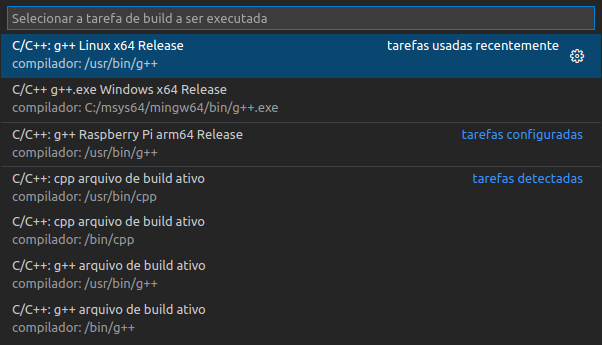

### Compilando e Executando o Projeto para Linux x64

Para compilar o Projeto, é necessário manter o aquivo `main.cpp` selecionado no Visual Studio Code.

> O VS Code tenta compilar o arquivo ativo por meio da variável de referência `${file}`, você pode encontrar outras variáveis neste [link](https://code.visualstudio.com/docs/editor/variables-reference).

Selecione a Configuração de C/C++ que você deseja compilar.


Então aperte as teclas `Ctrl + Shift + B` para abrir o menu de compilação, então escolha qual `task` você deseja executar.



Caso tenha ocorrido tudo certo, você verá a seguinte mensagem:


Após isso, você encontrará o arquivo `main` dentro da pasta `build/linux`.

Agora copie a pasta `fei` que está na raiz do projeto para o mesmo diretório do executável `build/linux`.

Para executar o arquivo `main`, basta abrir o terminal no mesmo diretório do executável e digitar o comando:

```bash
$ ./main
```

E com isso, você verá o seguinte resultado:

