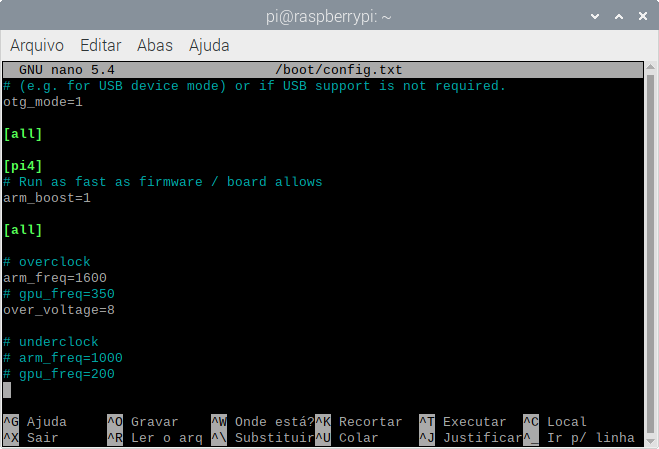

### Compilando e Executando o Projeto para Linux x64

O Visual Studio Code é pessado demais para o Raspberry Pi 3 B+ conseguir compilar o Projeto, por esse motivo a compilação deve ser feita usando o Terminal de Comando.

O comando para compilar o projeto é o seguinte:
```bash
$ /usr/bin/g++ -std=c++14 -lpthread /home/pi/Documents/CppProjects/SimpleFaceDetection/main.cpp -O3 -I /home/pi/Documents/CppProjects/SimpleFaceDetection/dep/dlib/include -I /home/pi/Documents/CppProjects/SimpleFaceDetection/dep/dlib/include/dlib/external/libjpeg -L /home/pi/Documents/CppProjects/SimpleFaceDetection/dep/dlib/lib -l dlib -D DLIB_JPEG_SUPPORT -o /home/pi/Documents/CppProjects/SimpleFaceDetection/build/linux/main
```

Esse é o exato comando que o Visual Studio Code usa para compilar o projeto, porém esse comando é muito longo, não que seja um problema, pois ele pode ser executado pelo Terminal independente do diretório.

Existe um comando mais simples para compilar o projeto, mas você deve executar o ele no diretório do projeto.

Segue o comando:
```bash
$ g++ -std=c++14 main.cpp -O3 -I dep/dlib/include -I dep/dlib/include/dlib/external/libjpeg -L dep/dlib/lib -l dlib -lpthread -lX11 -lnsl -D DLIB_JPEG_SUPPORT -o build/linux/main
```


Esse comando demora vários minutos para compilar, talvez até trave o Raspberry Pi. Caso isso ocora, você pode fazer underclock para que o Raspberry Pi não trave.

Para fazer o underclock, edite o arquivo `config.txt` com o comando:
```bash
$ sudo nano /boot/config.txt
```

E adicione no final do arquivo as seguintes linhas:
```text
# underclock
arm_freq=1000
gpu_freq=200
```

Após isso, pressione `Ctrl + O` e `Enter` para Gravar o arquivo e `Ctrl + X` para sair.

Então reinicie o Raspberry Pi para que a alteração seja aplicada.

Você pode verificar a frequência do Raspberry Pi no terminal com o comando:
```bash
$ sudo cat /sys/devices/system/cpu/cpu0/cpufreq/cpuinfo_max_freq
```

Outra forma de compilar o programa, é executar o comando remotamente, conectando-se ao Raspberry Pi via SSH.

> É necessário habilitar o SSH no Raspberry Pi.

A vantagem de executar o comando remotamente é que não precisa iniciar a interface gráfica do Raspberry Pi, melhorando o desempenho.

> Para conectar ao Raspberry Pi via SSH pelo Windows, você pode utilizar o Programa [Putty](https://www.putty.org/).

Caso tenha ocorrido tudo certo, o arquivo `main` será gerado dentro da pasta `build/linux`.

Após compilar, copie a pasta `fei` que está na raiz do projeto para o mesmo diretório do executável `build/linux`.

Então navege até o diretório `build/linux` e execute o arquivo `main`.

```bash
$ ./main
```

E com isso, você verá o seguinte resultado:


Para conseguir esse resultado, foi realizado overclock no Raspberry Pi com a seguinte configuração:

```text
# overclock
arm_freq=1600
over_voltage=8
```



> Esse resultado pode variar de acordo com a configuração do Raspberry Pi.