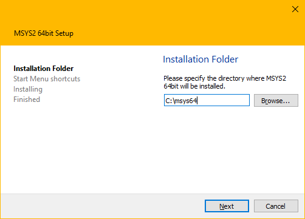
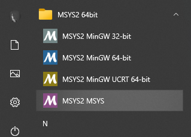
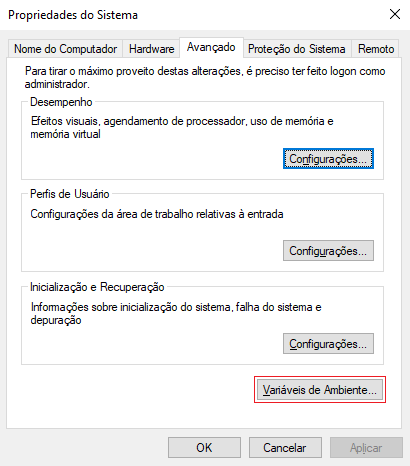
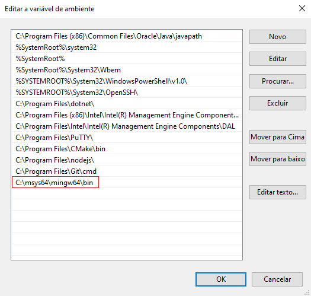

### Configurando o MinGW 64-bit

Baixe e execute o instalador do [MSYS2](https://www.msys2.org/).

Escolha o diretório de instalação:



Marque a opção `Run MSYS2 64bit now` e clique em `Finish`.


No terminal do MSYS2, execute o comando:

```bash
$ pacman -Syu
```

Confirme o comando digitando `Y`.

No Menu Iniciar, abra novamente o `MSYS2 MSYS`:



No Terminal do MSYS2, atualize os pacotes básicos com o comando:

```bash
$ pacman -Su
```

Confirme o comando digitando `Y`.

Instale o `MinGW 64-bit` com o comando:

```bash
$ pacman -S --needed base-devel mingw-w64-x86_64-toolchain
```

Confirme o comando digitando `Y`.

No Menu Iniciar, digite `variáveis de ambiente`, aperte `Enter`, na janela de `Propriedades do Sistema`, clique no botão `Variáveis de Ambiente...`:



Localize a seção das `Variáveis do sistema`.

Edite a variável `Path` e adicione o diretório `C:\msys64\mingw64\bin` no final dessa lista.

