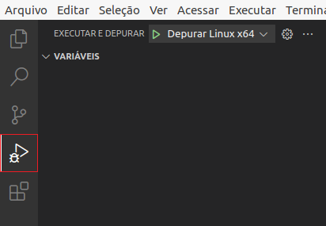
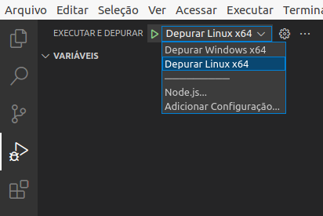
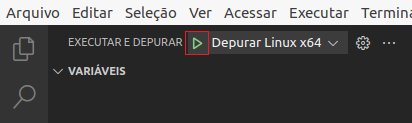
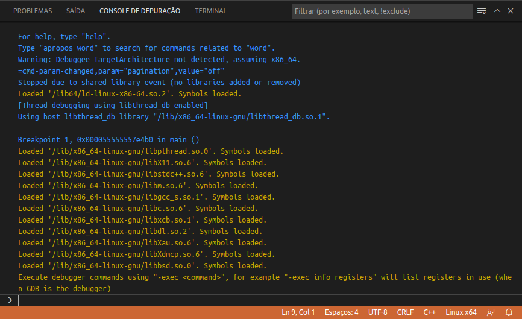

### Debugando o Projeto para Linux x64

Mantenha o arquivo `main.cpp` selecionado no Editor do VS Code.

Alterne para o modo de debug, apertando as teclas `Ctrl + Shift + D` ou clicando no botão de `Debug` no menu de contexto do arquivo.

Em seguida, escolhar qual configuração de debug você deseja executar.

Então precione `F5` ou clique no botão para iniciar para iniciar o Debug:

Ao executar o Debug, é possível ver na aba `CONSOLE DE DEPURAÇÃO` todas os objetos compartilhados `.so` que são carregados pelo VS Code.

