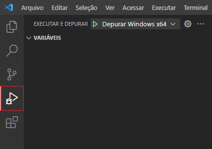
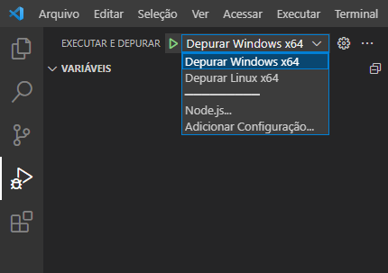
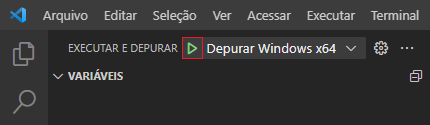
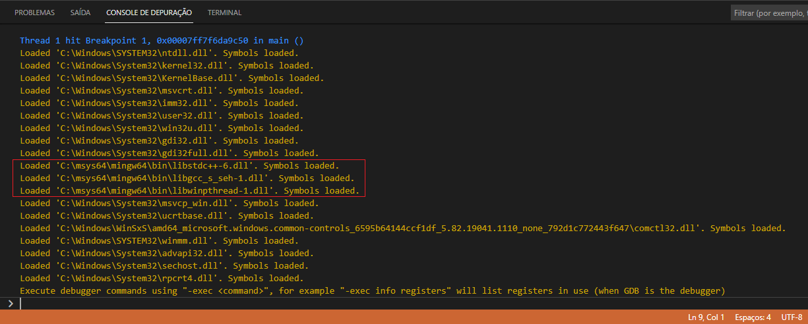
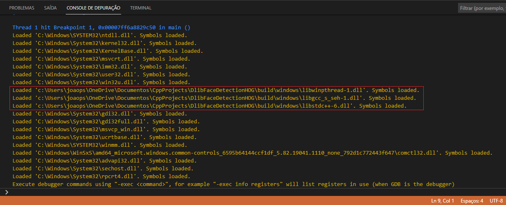
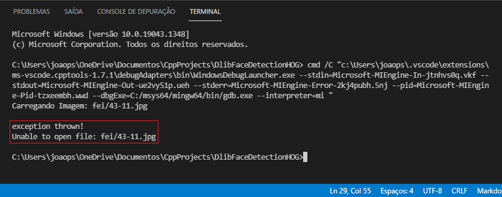

### Debugando o Projeto para Windows x64

Mantenha o arquivo `main.cpp` selecionado no Editor do VS Code.

Alterne para o modo de debug, apertando as teclas `Ctrl + Shift + D` ou clicando no botão de `Debug` no menu de contexto do arquivo.

Em seguida, escolhar qual configuração de debug você deseja executar.

Então procione `F5` ou clique no botão para iniciar para iniciar o Debug:

Ao executar o Debug, é possível ver na aba `CONSOLE DE DEPURAÇÃO` todas as DLLs que são carregados pelo VS Code.

Caso você queira executar esse programa em um computador diferente, basta copiar as DLLs que estão no diretório `C:\msys64\mingw64\bin\` para o mesmo diretório do seu executável:

* libgcc_s_seh-1.dll
* libstdc++-6.dll
* libwinpthread-1.dll

Executando o debug mais uma vez, você pode ver que o programa já está carregando as DLLs localmente.

> Não é necessário copiar as DLLs do System32, apenas as do MinGW.

Ao executar o debug, está ocorendo um erro, pois a imagem não está sendo localizada:

Isso está ocorrendo porque o caminho da imagem está sendo informado de forma relativa, `string caminho_imagem = "fei/43-11.jpg";`, mas você pode alterar para o caminho absoluto, `string caminho_imagem = "C:/Users/joaops/OneDrive/Documentos/CppProjects/DlibFaceDetectionHOG/fei/43-11.jpg";` ou copiar a pasta `fei` temporariamente para o diretório `C:\msys64\mingw64\bin\`.

Após de realizar o debug, você pode voltar o caminho da imagem para o seu valor original ou deletar a pasta `fei` do diretório `C:\msys64\mingw64\bin\`.